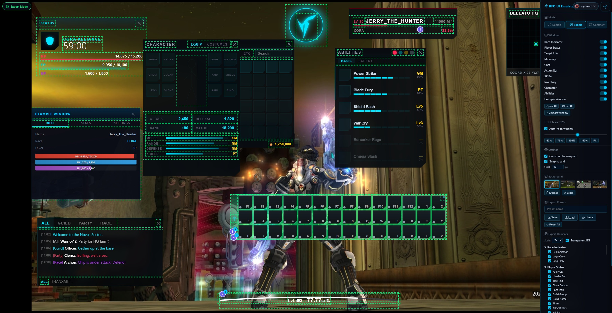

# RFO UI Emulator

A modular, browser-based interface emulator for **RF Online** — the classic sci-fi MMORPG. Design, arrange, comment on, and export pixel-perfect recreations of the game's HUD using a drag-and-drop canvas at native 1920×1080 resolution.



---

## Features

- **Modular Window System** — each HUD element is a self-contained module (HTML + CSS + JS) loaded at runtime
- **Drag & Drop** — move any window freely across the canvas
- **Resize Handles** — eight-directional resize with per-window min/max constraints
- **Right-Click Context Menu** — quick access to export, comment, layout, and window actions
- **Layout Presets** — save, load, and share entire UI arrangements (LZ-compressed URLs)
- **Image / ZIP Export** — export individual elements or the full viewport via html2canvas + JSZip
- **Auto-Fit Scale** — scales the 1920×1080 viewport to fit any browser size
- **Collaborative Comments** — pin threaded comment markers on any window
  - **Local mode** — anonymous, stored in-browser
  - **GitHub mode** — authenticate via GitHub OAuth, pins backed by GitHub Issues API
- **Dark Sci-Fi Aesthetic** — glassmorphism panels, cyan accents, clip-path cuts, glow effects

## Included Windows

| Window | Description |
|--------|-------------|
| **Player Status** | Race icon, guild name, timer, HP/FP/SP/DEF bars with cascading widths |
| **Target Info** | Enemy name, level, distance, health track, race badge |
| **Minimap** | Grid-based minimap with crosshair, player dot, zoom/center tools |
| **Chat Box** | Tabbed chat (ALL/GUILD/PARTY/RACE) with colored messages and input |
| **Action Bar** | Dynamic hotkey grid (F1–F9+) that reflows on resize via ResizeObserver |
| **XP Bar** | SVG arc with pathLength-based percentage fill and level display |
| **Inventory** | Dynamic grid with ResizeObserver, search, tabs, slot counter, gold |
| **Character** | Equipment slots with silhouette wireframe, stat grid, mastery bars |
| **Abilities** | Color-dot tabs, category headers, skill rows with segmented progress bars |

## Quick Start

1. Clone or download this repository
2. Serve from any local HTTP server (ES modules require it):
   ```
   npx serve .
   ```
   *or* open with VS Code Live Server
3. Open `http://localhost:3000` (or whichever port) in a modern browser

No build step, no dependencies to install — everything runs from vanilla JS + ES modules.

## Project Structure

```
rfo_ui_emulator/
├── index.html              # Main page — viewport, overlays, control panel
├── css/core.css            # Global styles, panel, toolbar, toast, auth UI
├── js/
│   ├── app.js              # Bootstrap — loads manifest, wires settings & auth
│   ├── config.js           # GitHub OAuth configuration
│   └── core/
│       ├── window-manager.js   # Creates, opens, closes, z-orders windows
│       ├── drag-engine.js      # Pointer-based drag with bounds clamping
│       ├── resize-engine.js    # Eight-handle resize with min/max enforcement
│       ├── context-menu.js     # Dynamic right-click menu
│       ├── layout-manager.js   # Save/load/share layout presets (LZ-string)
│       ├── export-manager.js   # html2canvas single + ZIP batch export
│       ├── comment-manager.js  # Pin placement, threads, Space toggle
│       ├── settings.js         # Observable settings store
│       ├── github-auth.js      # GitHub OAuth flow (popup + Cloudflare Worker)
│       └── pin-store.js        # Remote pin CRUD via GitHub Issues API
├── windows/
│   ├── manifest.json       # Window registry — IDs, folders, default positions
│   ├── _template/          # Starter template for new windows
│   ├── player-status/      # HP/FP/SP/DEF bars
│   ├── target-info/        # Enemy target overlay
│   ├── minimap/            # Grid minimap
│   ├── chat-box/           # Tabbed chat
│   ├── action-bar/         # Hotkey grid
│   ├── xp-bar/             # XP arc
│   ├── inventory/          # Item grid
│   ├── character/          # Equipment & stats
│   ├── abilities/          # Skills & progress
│   └── example-window/     # Reference / demo window
├── presets/                # Built-in layout preset files
├── assets/                 # Screenshots, images
├── worker/
│   └── auth-proxy.js       # Cloudflare Worker for GitHub OAuth token exchange
└── SETUP-COMMENTS.md       # Guide for enabling GitHub-backed comments
```

## Creating a New Window

1. Copy `windows/_template/` to `windows/my-window/`
2. Edit the three files:
   - **config.js** — export `id`, `title`, `dragHandle` selector, `resizable` settings, `exports[]` for image export, and optional `init(container)` function
   - **template.html** — the window's inner HTML (wrap in a root div with a data-export attribute)
   - **style.css** — styles scoped with `[data-window-id="my-window"]` attribute selector
3. Register in `windows/manifest.json`:
   ```json
   {
     "id": "my-window",
     "name": "My Window",
     "folder": "windows/my-window",
     "defaultPosition": { "x": 100, "y": 100, "width": 300, "height": 200 },
     "defaultOpen": true
   }
   ```
4. Reload the page — the window manager picks it up automatically.

## Keyboard Shortcuts

| Key | Action |
|-----|--------|
| **F2** | Toggle control panel |
| **Space** | Toggle comment pins visibility |
| **Escape** | Close context menu / cancel |

## GitHub Comments Setup

To enable collaborative GitHub-backed comments, see [SETUP-COMMENTS.md](SETUP-COMMENTS.md) for the 5-step guide covering:
- GitHub OAuth App creation
- Cloudflare Worker deployment for token exchange
- Configuration in `js/config.js`

## Tech Stack

- **HTML / CSS / ES Modules** — zero build, zero framework
- **html2canvas 1.4.1** — screenshot rendering
- **JSZip 3.10.1** — batch ZIP export
- **LZ-String 1.5.0** — layout preset compression
- **Cloudflare Workers** — OAuth token exchange proxy (optional)
- **GitHub Issues API** — remote comment storage (optional)

## Browser Support

Modern browsers with ES module support (Chrome 80+, Firefox 78+, Edge 80+, Safari 14+).

## License

MIT
